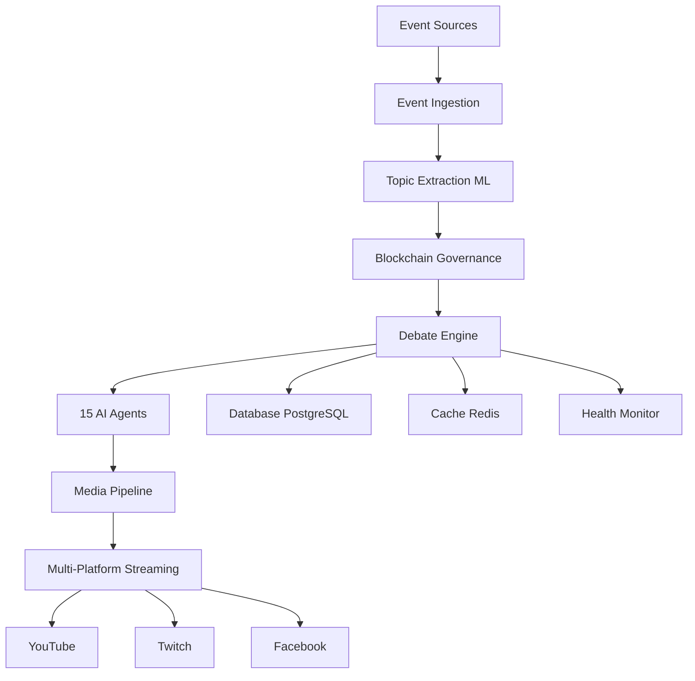

# AI Council System Documentation

Welcome to the AI Council System documentation! This is a comprehensive multi-agent AI debate platform that orchestrates 15 distinct AI personalities in structured, real-time debates.

<div class="grid cards" markdown>

-   :material-rocket-launch:{ .lg .middle } __Quick Start__

    ---

    Get up and running in 5 minutes with our quick start guide

    [:octicons-arrow-right-24: Quick Start](getting-started/quick-start.md)

-   :material-book-open-variant:{ .lg .middle } __User Guide__

    ---

    Learn how to create debates, automate scheduling, and stream to multiple platforms

    [:octicons-arrow-right-24: User Guide](user-guide/debates/creating.md)

-   :material-code-braces:{ .lg .middle } __API Reference__

    ---

    Complete API documentation with examples and interactive testing

    [:octicons-arrow-right-24: API Docs](api/overview.md)

-   :material-cloud-upload:{ .lg .middle } __Deployment__

    ---

    Deploy to production with Docker, Kubernetes, or cloud platforms

    [:octicons-arrow-right-24: Deployment](deployment/quick-deploy/overview.md)

</div>

## What is AI Council System?

The **AI Council System** is a production-ready platform for orchestrating multi-agent AI debates. It combines:

- **15 Distinct AI Personalities** - Each with unique debate styles, expertise areas, and interaction patterns
- **Real-Time Event Ingestion** - Monitors Twitter, Reddit, Discord, RSS for trending topics
- **Blockchain Governance** - Community voting on debate topics using Solana
- **Multi-Platform Streaming** - Simultaneous streaming to YouTube, Twitch, Facebook
- **Advanced Media Pipeline** - Animated avatars, voice synthesis, dynamic backgrounds, visual effects
- **Production Infrastructure** - Health monitoring, auto-scaling, analytics, comprehensive API

## Key Features

### 🤖 Multi-Agent Orchestration
Coordinate 15 AI agents with distinct personalities in structured debates. Agents include:
- The Pragmatist, The Visionary, The Skeptic, The Scientist
- The Ethicist, The Economist, The Rebel, The Moderate
- And 7 more unique personalities

### 🎥 Professional Media Production
- **Animated Avatars** with expression states (speaking, thoughtful, excited, concerned)
- **Voice Synthesis** with multiple TTS engines (ElevenLabs, Edge TTS, custom voices)
- **Dynamic Backgrounds** that react to debate sentiment
- **12+ Transition Effects** and 8+ visualization styles

### 📡 Multi-Platform Streaming
Stream debates simultaneously to:
- YouTube Live
- Twitch
- Facebook Live
- Custom RTMP endpoints

### ⚙️ Full Automation
- **24/7 Operation** with adaptive scheduling
- **Event-Driven Topics** extracted from real-world events
- **Auto-Recovery** from failures
- **Health Monitoring** with Prometheus + Grafana

### 🔗 Blockchain Integration
- Community voting on topics using Solana
- Decentralized randomness via Chainlink VRF
- Token economics with CNCL governance token

### 📊 Comprehensive Analytics
- Real-time debate metrics
- Consensus formation tracking
- Viewership analytics
- Performance monitoring

## System Architecture



## Use Cases

### 📚 Education
- Generate multi-perspective learning content
- Explore complex topics from different angles
- Create engaging educational videos

### 🔬 Research
- Study multi-agent AI coordination
- Analyze consensus formation patterns
- Investigate emergent behaviors

### 💼 Decision Support
- Analyze policies from multiple perspectives
- Generate comprehensive pro/con analysis
- Support strategic planning

### 🎬 Content Creation
- Automated debate content for streaming
- Educational video production
- Engaging social media content

## Quick Start

Get started in 3 simple steps:

=== "Docker (Recommended)"

    ```bash
    # 1. Clone the repository
    git clone https://github.com/your-org/ai-council-system.git
    cd ai-council-system

    # 2. Configure environment
    cp .env.example .env
    # Edit .env with your API keys

    # 3. Start the system
    docker-compose -f docker/docker-compose.yml up -d

    # 4. Run your first debate
    ./ai-council debate start "Should AI be regulated?"
    ```

=== "Python"

    ```bash
    # 1. Clone and setup
    git clone https://github.com/your-org/ai-council-system.git
    cd ai-council-system
    python -m venv venv
    source venv/bin/activate

    # 2. Install dependencies
    pip install -r requirements.txt

    # 3. Configure
    cp .env.example .env
    # Edit .env with your API keys

    # 4. Run demo
    python examples/demo_debate.py
    ```

=== "One-Click Deploy"

    [](quick-deploy/digitalocean.md)

    [](quick-deploy/heroku.md)

## Performance Metrics

Our system delivers production-ready performance:

| Metric | Performance |
|--------|-------------|
| **Debate Generation** | ~30s per round (15 agents) |
| **Avatar Rendering** | ~100ms per frame @ 1080p |
| **Voice Synthesis** | ~2s per response (< 50ms cached) |
| **Stream Latency** | 2-5s end-to-end |
| **System Uptime** | 99.9% with auto-recovery |
| **Concurrent Debates** | Up to 10 (scales with resources) |

## Technology Stack

### Core Technologies
- **Python 3.11+** - Primary language
- **FastAPI** - REST API framework
- **PostgreSQL** - Primary database
- **Redis** - Caching and pub/sub
- **Docker** - Containerization

### AI & ML
- **Anthropic Claude** - Advanced reasoning
- **OpenAI GPT-4** - Multi-purpose intelligence
- **Ollama** - Local model support
- **ElevenLabs** - Voice synthesis
- **Sentence Transformers** - Topic extraction

### Media & Streaming
- **Pillow** - Image generation
- **pyttsx3** - Text-to-speech
- **FFmpeg** - Video processing
- **OBS** - Streaming (optional)

### Infrastructure
- **Kubernetes** - Orchestration
- **Prometheus** - Metrics
- **Grafana** - Visualization
- **Nginx** - Reverse proxy

## Community & Support

### Get Help
- 📖 **Documentation**: You're reading it!
- 💬 **Discord**: [Join our community](https://discord.gg/aicouncil)
- 🐛 **Issues**: [GitHub Issues](https://github.com/your-org/ai-council-system/issues)
- 📧 **Email**: support@aicouncil.example.com

### Contribute
We welcome contributions! See our [Contributing Guide](community/contributing.md) to get started.

- **Good First Issues**: [View on GitHub](https://github.com/your-org/ai-council-system/labels/good%20first%20issue)
- **Feature Requests**: [Submit ideas](https://github.com/your-org/ai-council-system/issues/new)
- **Pull Requests**: [Contribution guidelines](community/contributing.md)

### Stay Updated
- 🐦 **Twitter**: [@AICouncilSystem](https://twitter.com/AICouncilSystem)
- 📝 **Blog**: [Latest updates](community/blog.md)
- 🗺️ **Roadmap**: [Future plans](community/roadmap.md)

## License

This project is licensed under the **MIT License** - see the [LICENSE](community/license.md) file for details.

---

## What's Next?

<div class="grid cards" markdown>

-   **New to AI Council?**

    Start with our [Quick Start Guide](getting-started/quick-start.md) to run your first debate in minutes.

-   **Ready to Deploy?**

    Check out [Deployment Options](deployment/quick-deploy/overview.md) for production setup.

-   **Want to Contribute?**

    Read the [Developer Guide](development/developer-guide.md) and join our community!

-   **Need API Access?**

    Explore the [API Reference](api/overview.md) for integration options.

</div>

---

<center>
**Built with :heart: by the AI Council System community**

[GitHub](https://github.com/your-org/ai-council-system){ .md-button }
[Discord](https://discord.gg/aicouncil){ .md-button }
[Get Started](getting-started/quick-start.md){ .md-button .md-button--primary }
</center>
